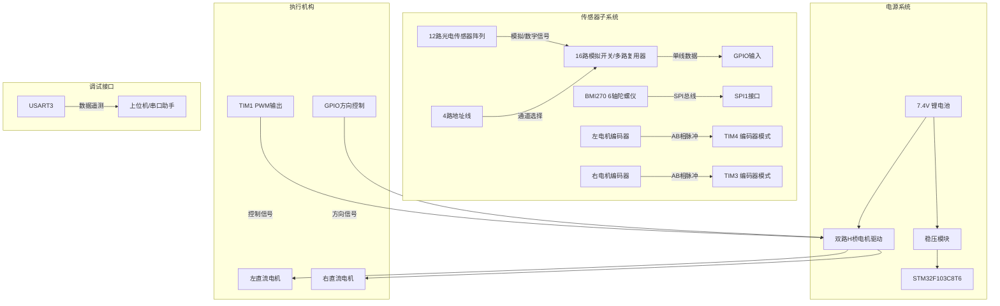
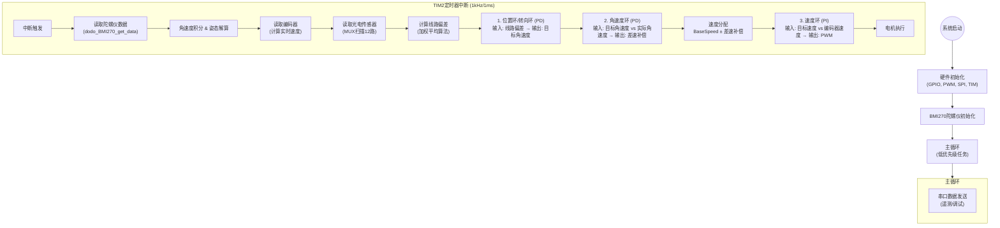

# STM32智能循迹小车控制系统

## 📜 项目简介
基于STM32F103的高性能智能循迹小车，采用**多传感器融合**与**三级串级PID控制**架构，实现了高速、稳定的循迹功能。系统集成了12路光电传感器阵列、BMI270六轴惯性测量单元(IMU)以及高精度编码器，能够应对复杂赛道（如虚线、直角弯、S弯）。

## 🏗️ 系统架构

### 硬件架构图
系统以STM32F103C8T6为核心，通过多路复用器读取传感器阵列，利用SPI接口获取陀螺仪数据，并通过定时器进行电机闭环控制。



### 软件控制流图
系统采用1ms的时间片轮询架构，在定时器中断中完成所有控制逻辑，保证了控制的实时性。



## 🧠 核心控制原理

本系统采用了先进的**三级串级控制策略**，相比传统的单环PID，具有更强的抗干扰能力和动态响应特性。

### 1. 传感器数据处理算法

#### 光电传感器加权平均与特殊处理
为了从离散的12路传感器数据中获取连续的偏差值，系统采用了加权平均算法，并针对特殊路况进行了优化。

- **加权计算**：给每个传感器分配权重 `weights = {11, 9, ..., -9, -11}`。
- **偏差公式**：

$$
Deviation = \frac{\sum (ActiveSensor_i \times Weight_i)}{\sum ActiveSensor_i}
$$
- **特殊路况处理**：
    - **丢线处理**：当所有传感器均未检测到线时，根据上一时刻的偏差值 `last_deviation` 锁定最大转向输出（±8.0），实现"记忆"功能，防止冲出赛道。
    - **急弯增强**：当检测到只有单侧传感器触发（如只有最左侧）而另一侧完全无信号时，人为增加偏差补偿（`deviation ± 1.5`），提高急弯响应速度。

#### 陀螺仪姿态解算
- 使用 `BMI270` 读取Z轴角速度。
- 对角速度进行积分得到当前的相对航向角 `integrated_angle`，用于辅助判断车身姿态。

### 2. 三级串级PID控制系统

控制系统由外至内分为三层，每一层的输出作为下一层的输入：

1.  **最外层：转向环 (Position Loop)**
    *   **目标**：使小车始终保持在线路中心（偏差为0）。
    *   **输入**：光电传感器计算出的偏差值。
    *   **算法**：PD控制（比例+微分）。
    *   **输出**：**目标角速度 (Target Gyro Rate)**。
    *   *原理*：偏差越大，小车需要的转向角速度就越大。

2.  **中间层：角速度环 (Angular Rate Loop)**
    *   **目标**：让小车实际的转向快慢（角速度）精准跟随目标角速度。
    *   **输入**：目标角速度 - 实际角速度（陀螺仪Z轴数据）。
    *   **算法**：PD控制。
    *   **输出**：**左右电机差速补偿值**。
    *   *原理*：利用陀螺仪的高频响应特性，快速修正车身姿态，抑制转向时的震荡（如S弯中的甩尾）。

3.  **最内层：速度环 (Speed Loop)**
    *   **目标**：让电机转速恒定，克服摩擦力和电池电压波动。
    *   **输入**：目标速度（基础速度 ± 差速补偿） - 编码器反馈速度。
    *   **算法**：PI控制（比例+积分）。
    *   **输出**：**电机PWM占空比**。
    *   *原理*：积分项保证了稳态无误差，使小车在上坡或低电量时仍能保持设定速度。

## 💻 关键代码解析

### 1. 定时器中断触发控制周期
```c
void HAL_TIM_PeriodElapsedCallback(TIM_HandleTypeDef *htim)
{
    if(htim->Instance == TIM2) { /* 使用TIM2作为控制周期*/
        PID_Control();
    }
}
```
- **频率**: 1kHz（TIM2配置：预分频71，周期999）
- **作用**: 每1ms执行一次完整的PID控制循环

### 2. 主PID控制流程 (main.c)
```c
void PID_Control(void)
{
    /* 步骤1: 读取传感器数据 */
    Update_Gyro_Data();                    // 更新陀螺仪数据
    float current_deviation = Calculate_Deviation();  // 计算光电偏差
    
    /* 步骤2: 读取编码器值 */
    left_encoder = __HAL_TIM_GET_COUNTER(&htim4);
    right_encoder = __HAL_TIM_GET_COUNTER(&htim3);
    
    /* 步骤3: 转向环控制 */
    float turn_output = KP_turn * current_deviation + 
                       KD_turn * (current_deviation - last_deviation);
    last_deviation = current_deviation;
    
    /* 步骤4: 角速度环控制 */
    target_gyro_rate = turn_output;  // 转向环输出作为目标角速度
    float gyro_output = Gyro_Rate_Control(target_gyro_rate, gyro_z);
    
    /* 步骤5: 速度分配 */
    float left_target = 500.0f - gyro_output;  // 基础速度500，实际需调整
    float right_target = 500.0f + gyro_output;
    
    /* 步骤6: 速度环控制 */
    // 编码器差值计算速度（简化处理，实际应计算真实速度）
    float left_error = left_target - left_speed;
    float right_error = right_target - right_speed;
    
    left_integral += left_error;    // 积分项
    right_integral += right_error;
    
    // 积分限幅
    if(left_integral > 1000) left_integral = 1000;
    if(left_integral < -1000) left_integral = -1000;
    if(right_integral > 1000) right_integral = 1000;  
    if(right_integral < -1000) right_integral = -1000;
    
    /* 步骤7: 计算PWM输出 */
    left_pwm = KP_speed * left_error + KI_speed * left_integral;
    right_pwm = KP_speed * right_error + KI_speed * right_integral;
    
    /* 步骤8: 驱动电机 */
    Motor_Control(left_pwm, right_pwm);
}
```

### 3. 传感器数据采集流程

#### 3.1 光电传感器数据获取
```c
float Calculate_Deviation(void)
{
    uint16_t mux_value;
    MUX_get_value(&mux_value);  // 获取多路复用器值
    
    float deviation = 0;
    int count = 0;
    
    /* 遍历12个光电管 */
    for(int i = 0; i < 12; i++) {
        if(MUX_GET_CHANNEL(mux_value, i)) {
            deviation += phototube_weights[i];  // 加权求和
            count++;
        }
    }
    
    /* 处理不同情况 */
    if(count > 0) {
        deviation = deviation / count;  // 计算平均偏差
    } else {
        /* 丢线处理 */
        if(last_deviation > 3.0f) deviation = 8.0f;
        else if(last_deviation < -3.0f) deviation = -8.0f;
        else deviation = -8.0f;
    }
    
    /* 限制偏差范围 */
    if(deviation > 11.0f) deviation = 11.0f;
    if(deviation < -11.0f) deviation = -11.0f;
    
    return deviation;
}
```

#### 3.2 陀螺仪数据更新
```c
void Update_Gyro_Data(void)
{
    /* 读取原始数据 */
    dodo_BMI270_get_data();
    
    /* 转换为角速度 */
    gyro_z = BMI270_gyro_transition(BMI270_gyro_z);
    
    /* 积分计算角度 */
    uint32_t current_time = HAL_GetTick();
    if(last_gyro_time > 0) {
        float dt = (current_time - last_gyro_time) / 1000.0f;
        integrated_angle += gyro_z * dt;
        
        /* 角度限幅 */
        if(integrated_angle > 180.0f) integrated_angle = 180.0f;
        if(integrated_angle < -180.0f) integrated_angle = -180.0f;
    }
    last_gyro_time = current_time;
}
```

## ⚙️ 硬件规格

| 模块 | 型号/参数 | 作用 |
| :--- | :--- | :--- |
| **主控芯片** | STM32F103C8T6 | 72MHz主频，处理核心算法 |
| **姿态传感器** | BMI270 | 16-bit 陀螺仪，提供高精度角速度反馈 |
| **循迹模块** | 自研12路红外对管 | 配合74HC4067多路复用器读取 |
| **电机驱动** | 双路H桥驱动 | 支持大电流，PWM频率10kHz |
| **电源** | 2S 锂电池 (7.4V) | 为电机和LDO供电 |

## 🚀 快速开始

1.  **环境准备**: 安装 STM32CubeIDE 或 Keil MDK。
2.  **硬件连接**: 
    - 确保电池电压充足 (>7.0V)。
    - 检查电机线序是否正确（影响正反转）。
3.  **参数整定**:
    - 优先调节 `KP_speed` 和 `KI_speed` 保证速度稳定。
    - 调节 `KP_turn` 直到小车能大致沿线走。
    - 加入 `KP_gyro` 抑制快速过弯时的震荡。
4.  **调试**: 连接串口 (波特率115200)，查看输出的 `GyroZ` 和 `PhotoDev` 数据波形。

---
*Project maintained by HITSZ Mini-Car Team*
